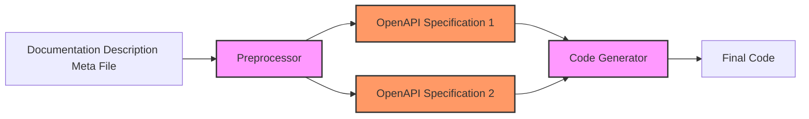

# KuCoin Universal SDK

  


The  **KuCoin Universal SDK** is the official SDK provided by KuCoin, offering a unified and seamless interface for accessing KuCoin's trading platform. Built using code generation technology, it ensures consistency and rapid updates across multiple programming languages, simplifying integration with consistent APIs.


## 🚀 Features

- **Unified API for Spot, Futures, and Broker**: Combines APIs for Spot Trading, Futures Trading, and Broker services into a single SDK, offering seamless integration.

- **Well-Designed Abstractions**: Provides clear and consistent abstractions to simplify development while maintaining flexibility.

- **Strong Typing Support**: Built with strong typing to ensure code correctness and reliability, enhancing the developer experience.

- **Intuitive Usage Patterns**: Designed for ease of use with minimal learning curve, featuring detailed documentation and in-code comments.

- **Editor and IDE Friendly**: Fully compatible with popular editors and IDEs, offering intelligent autocompletion, type hints, and inline documentation.

- **Language-Standard Compliance**: Adheres to the coding conventions and standards of the supported programming languages for consistent and predictable behavior.

- **Extensibility**: Designed with modularity in mind, enabling developers to easily extend or adapt the SDK to meet specific use cases or integrate additional features.

## 📄 API List

| File               | Description                                           |
|--------------------|-------------------------------------------------------|
| [`spec/apis.csv`](spec/apis.csv) | A complete list of all REST APIs.                        |
| [`spec/ws.csv`](spec/ws.csv)     | A complete list of all WebSocket-specific APIs.          |


## 🛠️ Installation

### Latest Version: `1.1.0`

### Python Installation

```bash
pip install kucoin-universal-sdk
```

### Golang Installation

```bash
go get github.com/Kucoin/kucoin-universal-sdk/sdk/golang
go mod tidy
```

### Postman Installation  
Visit the [KuCoin API Collection on Postman](https://www.postman.com/kucoin-api/kucoin-api/overview)

## 📖 Getting Started

Here's a quick example to get you started with the SDK in **Python**.

```python
import logging
import os

from kucoin_universal_sdk.api.client import DefaultClient
from kucoin_universal_sdk.generate.spot.market.model_get_part_order_book_req import GetPartOrderBookReqBuilder
from kucoin_universal_sdk.model.client_option import ClientOptionBuilder
from kucoin_universal_sdk.model.constants import GLOBAL_API_ENDPOINT, GLOBAL_FUTURES_API_ENDPOINT, \
    GLOBAL_BROKER_API_ENDPOINT
from kucoin_universal_sdk.model.transport_option import TransportOptionBuilder


def example():
    logging.basicConfig(
        level=logging.INFO,
        format='%(asctime)s %(levelname)s - %(message)s',
        datefmt='%Y-%m-%d %H:%M:%S'
    )

    #  Retrieve API secret information from environment variables
    key = os.getenv("API_KEY", "")
    secret = os.getenv("API_SECRET", "")
    passphrase = os.getenv("API_PASSPHRASE", "")

    # Set specific options, others will fall back to default values
    http_transport_option = (
        TransportOptionBuilder()
        .set_keep_alive(True)
        .set_max_pool_size(10)
        .set_max_connection_per_pool(10)
        .build()
    )

    # Create a client using the specified options
    client_option = (
        ClientOptionBuilder()
        .set_key(key)
        .set_secret(secret)
        .set_passphrase(passphrase)
        .set_spot_endpoint(GLOBAL_API_ENDPOINT)
        .set_futures_endpoint(GLOBAL_FUTURES_API_ENDPOINT)
        .set_broker_endpoint(GLOBAL_BROKER_API_ENDPOINT)
        .set_transport_option(http_transport_option)
        .build()
    )
    client = DefaultClient(client_option)

    # Get the Restful Service
    kucoin_rest_service = client.rest_service()

    spot_market_api = kucoin_rest_service.get_spot_service().get_market_api()

    # Query for part orderbook depth data. (aggregated by price)
    request = GetPartOrderBookReqBuilder().set_symbol("BTC-USDT").set_size("20").build()
    response = spot_market_api.get_part_order_book(request)
    logging.info(f"time={response.time}, sequence={response.sequence}, "
                 f"bids={response.bids}, asks={response.asks}")


if __name__ == "__main__":
    example()

```
For other languages, refer to the [Examples](#-examples) section.

## 📚 Documentation 

- Official Documentation: [KuCoin API Docs](https://www.kucoin.com/docs-new)  
- **[Python Documentation](sdk/python/README.md)**
- **[Go Documentation](sdk/golang/README.md)**
- **[Postman Documentation](sdk/postman/README.md)**

## 📂 Examples
Find usage examples for your desired language by selecting the corresponding link below:

| Language | Example Directory                          |
|----------|--------------------------------------------|
| Python   | [sdk/python/examples/](sdk/python/example/)|
| Go       | [sdk/go/examples/](sdk/golang/example/) |

## 📋 Changelog

For a detailed list of changes, see the [Changelog](./CHANGELOG.md).

## 🏗️ Technical Design

The KuCoin Universal SDK is built with a code-generation-first approach to ensure consistency, scalability, and rapid updates across all supported languages. By leveraging the OpenAPI Specification and a custom code generator, the SDK achieves the following advantages:

- **Consistency**: All SDKs provide a unified experience by adhering to the same core design principles, regardless of the programming language.
- **Scalability**: Modular design allows for easy extension of functionality and quick adaptation to API changes.
- **Rapid Updates**: Updates to the API can be seamlessly reflected in all SDKs by simply regenerating the code from the updated specifications.
- **Language-Specific Optimization**: Generated code follows idiomatic practices of the target language, ensuring a natural developer experience.

This design ensures that developers can rely on the SDK for high-quality, up-to-date, and consistent integrations across all languages.

### 🔧 Code Generation Workflow


1. **OpenAPI Specification**:
   - All SDKs are generated based on the official KuCoin OpenAPI specifications.
   - This ensures that the SDK always aligns with the latest API updates.

2. **Code Generator**:
   - The SDK leverages a custom code generator built on top of the OpenAPI Generator.
   - The generator is tailored to produce idiomatic code for each target language, adhering to its conventions and best practices.

3. **Generated Code Structure**:
   - Each language SDK is organized into specific modules to provide clear separation of concerns and ease of use.
   - Consistent abstractions ensure similar functionality and design principles across all supported languages.

### 📂 Directory Structure

The following table describes the key components of the project directory:

| Path                    | Description                                                                 |
|-------------------------|-----------------------------------------------------------------------------|
| `Dockerfile`            | Docker configuration for building and testing the SDK.                     |
| `LICENSE`               | The MIT license file.                                                      |
| `Makefile`              | Makefile for project automation (e.g., building, testing, generating code).|
| `README.md`             | Main documentation file.                                                   |
| `generate.mk`           | Additional Makefile specifically for code generation tasks.                |
| `generator/`            | Directory containing the code generation logic.                            |
| `sdk/`                  | Directory for generated SDKs organized by language.                        |
| `spec/`                 | Directory containing API specification files.                              |

## ⚙️ Build and Test Guide

### Prerequisites

Before you begin, ensure the following dependencies are installed:
- Docker: For containerized builds and tools.
- Make: To execute the provided Makefile targets.

---

### Steps

1. **Build the Tools**  
   Build the Docker image used for code generation and validation.  
   Command: `make build-tools`

2. **Preprocess Specifications**  
   Clean up old API files and run the preprocessor to process new API specifications.  
   Command: `make preprocessor`

3. **Validate API Specifications**  
   Validate all REST and WebSocket specifications to ensure correctness.  
   Command: `make validate`

4. **Generate SDK Code**  
   Generate SDK code for all supported languages.  
   Command: `make generate`

5. **Run Tests**  
   Run automatically generated tests for all SDKs.
   Command: `make test`

6. **Run All Steps**  
   Execute the entire pipeline: build tools, preprocess specifications, validate, and generate code.  
   Command: `make all`


## 🤝 Contribution Guidelines

We welcome contributions from the community! Please check out our [Contribution Guidelines](CONTRIBUTING.md) for details on how to get involved.

## 📝 License

This project is licensed under the MIT License. For more details, see the [LICENSE](LICENSE) file.

### Third-Party Licenses

This project uses the following dependency licensed under the **Apache License 2.0**:
- **OpenAPI Generator**: For generating SDK code from OpenAPI specifications.

You must comply with the terms of the Apache License 2.0 when using or distributing this dependency. For more information, refer to the [Apache License](https://www.apache.org/licenses/LICENSE-2.0).

## 📧 Contact Support

If you encounter any issues or have questions, feel free to reach out through:
- GitHub Issues: [Submit an Issue](https://github.com/kucoin/kucoin-universal-sdk/issues)  

## ⚠️ Disclaimer

- **Financial Risk**: This SDK is provided as a development tool to integrate with KuCoin's trading platform. It does not provide financial advice. Trading cryptocurrencies involves substantial risk, including the risk of loss. Users should assess their financial circumstances and consult with financial advisors before engaging in trading.
  
- **No Warranty**: The SDK is provided "as is" without any guarantees of accuracy, reliability, or suitability for a specific purpose. Use it at your own risk.

- **Compliance**: Users are responsible for ensuring compliance with all applicable laws and regulations in their jurisdiction when using this SDK.

By using this SDK, you acknowledge that you have read, understood, and agreed to this disclaimer.
