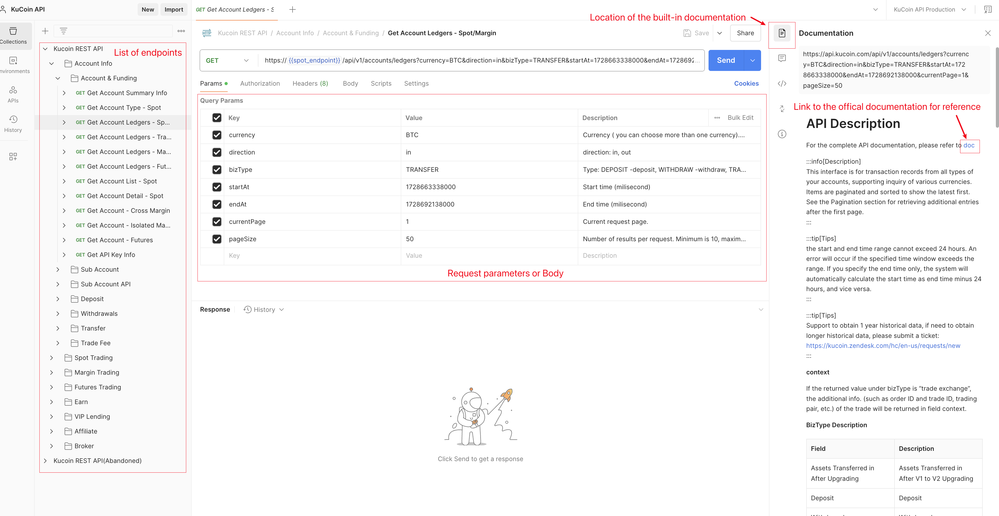
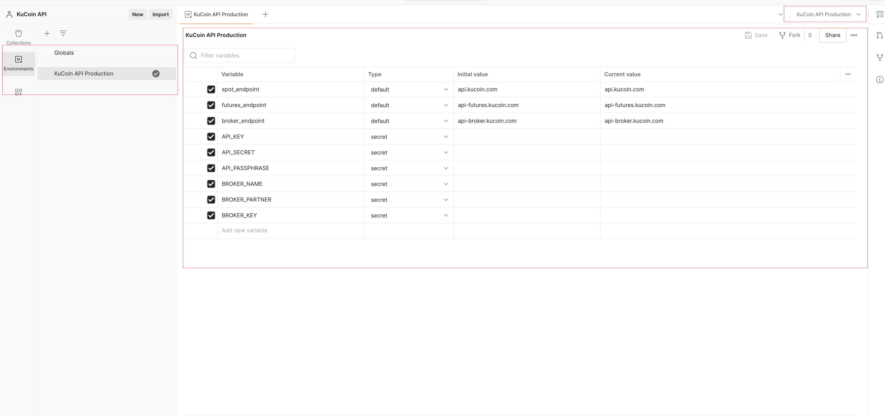
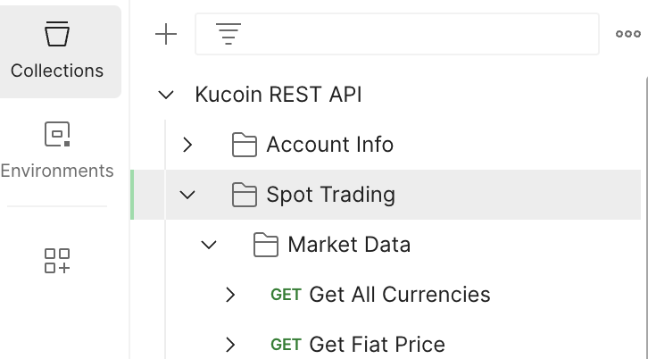
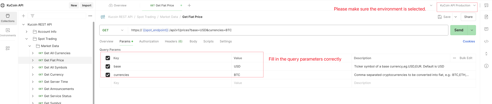
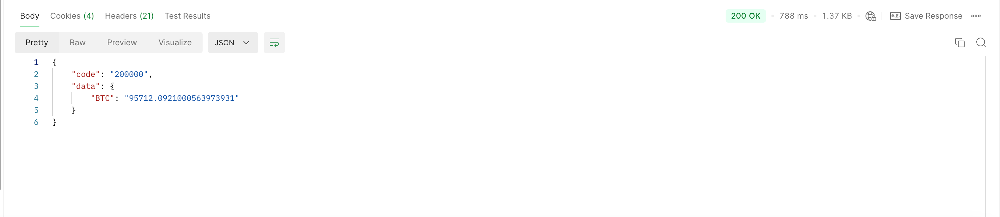

# Postman API Collection Documentation

Welcome to the **Postman API Collection** for the KuCoin Universal SDK. This collection is designed to provide a quick and interactive way to explore and test the KuCoin APIs directly within Postman.

For an overview of the KuCoin Universal SDK and implementations in other languages, refer to the [README](https://github.com/kucoin/kucoin-universal-sdk).

## 📦 Installation

**Note:** The API collection is actively maintained and updated in line with KuCoin's API specifications. Feedback and contributions to improve the collection are highly encouraged.

1. Visit the official Postman collection shared link: [KuCoin API Collection on Postman](https://www.postman.com/kucoin-api/kucoin-api/overview).
2. Log in to your Postman account on the web (or create one if you don't have an account).
3. Click **Run in Postman** or **Fork Collection** to add the collection directly to your Postman workspace.
4. Once added, navigate to your workspace, where the collection will be available for immediate use.
5. If you are using the Postman desktop app, the collection will automatically sync with your desktop workspace once added to your account.
6. Configure the environment variables according to your API credentials and begin testing KuCoin's APIs.

## Set Up Environment Variables

To use the collection effectively, follow these steps:

#### Steps to Configure

1. In Postman, select the preconfigured environment named **`KuCoin API Production`** from the **Environment** dropdown.
2. Fill in the following variables based on your usage needs:
   - **Mandatory Variables** (required only for private API endpoints):
     - `API_KEY`: Your KuCoin API key.
     - `API_SECRET`: Your KuCoin API secret.
     - `API_PASSPHRASE`: Your KuCoin API passphrase.
   - **Optional Variables** (only required for broker-related APIs):
     - `BROKER_NAME`: Name of the broker account.
     - `BROKER_PARTNER`: Partner information associated with the broker account.
     - `BROKER_KEY`: Key associated with the broker account for authentication.
3. For public API endpoints (e.g., market data), the mandatory variables are not required and can be left blank.
4. Save the environment to ensure all variables are correctly applied.
5. Return to the Postman main interface and select **`KuCoin API Production`** from the **Environment** dropdown to activate the configuration.
6. Once configured, you're ready to use the Postman collection.

#### Variable Reference

| Variable          | Description                                                     | Example Value             |
|-------------------|-----------------------------------------------------------------|---------------------------|
| `spot_endpoint`   | Base URL for Spot API endpoints.                                | `https://api.kucoin.com`  |
| `futures_endpoint`| Base URL for Futures API endpoints.                             | `https://api-futures.kucoin.com` |
| `broker_endpoint` | Base URL for Broker API endpoints.                              | `https://api-broker.kucoin.com` |
| `API_KEY`         | Your KuCoin API key.                                            |                           |
| `API_SECRET`      | Your KuCoin API secret.                                         |                           |
| `API_PASSPHRASE`  | Your KuCoin API passphrase.                                     |                           |
| `BROKER_NAME`     | *(Optional)* Name of the broker account. Required only for broker-related APIs. |                           |
| `BROKER_PARTNER`  | *(Optional)* Partner information associated with the broker account. Required only for broker-related APIs. |                           |
| `BROKER_KEY`      | *(Optional)* Key associated with the broker account for authentication. Required only for broker-related APIs. |                           |

## 📖 Getting Started

Here's a quick guide to interact with KuCoin APIs using the Postman collection:

### Step 1: Open the Collection

### Step 2: Send a Request

### Step 3: View Responses

## 📝 Documentation

For detailed information about the API endpoints, refer to the official KuCoin API documentation:

- [KuCoin API Docs](https://www.kucoin.com/docs-new)

## 📋 Changelog

For a detailed list of changes, see the [Changelog](./CHANGELOG.md).

## 📧 Contact Support

If you encounter any issues or have questions, feel free to reach out through:

- GitHub Issues: [Submit an Issue](https://github.com/kucoin/kucoin-universal-sdk/issues)

## ⚠️ Disclaimer

- **Financial Risk**: This Postman collection is provided as a tool to explore KuCoin's APIs. It does not provide financial advice. Trading cryptocurrencies involves substantial risk, including the risk of loss. Users should assess their financial circumstances and consult with financial advisors before engaging in trading.
- **No Warranty**: The collection is provided "as is" without any guarantees of accuracy, reliability, or suitability for a specific purpose. Use it at your own risk.
- **Compliance**: Users are responsible for ensuring compliance with all applicable laws and regulations in their jurisdiction when using this collection.

By using this Postman collection, you acknowledge that you have read, understood, and agreed to this disclaimer.
